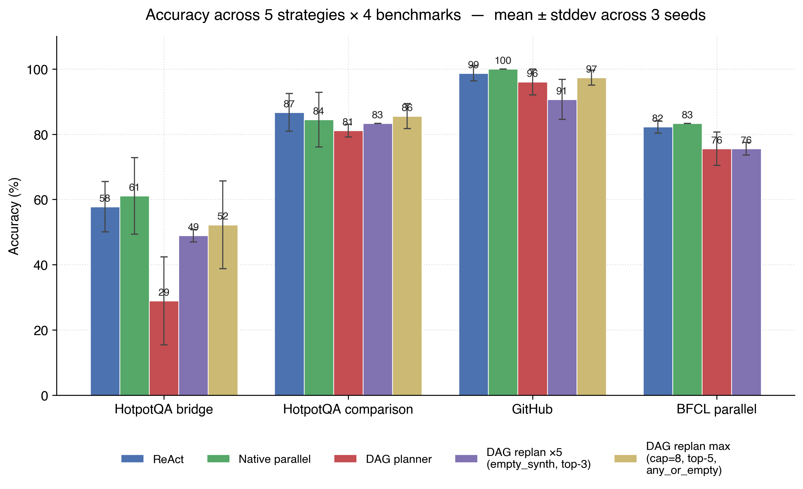
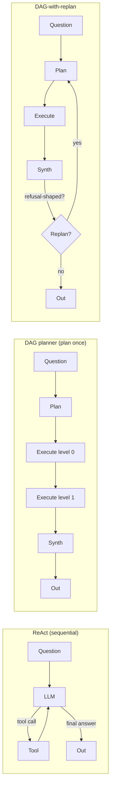
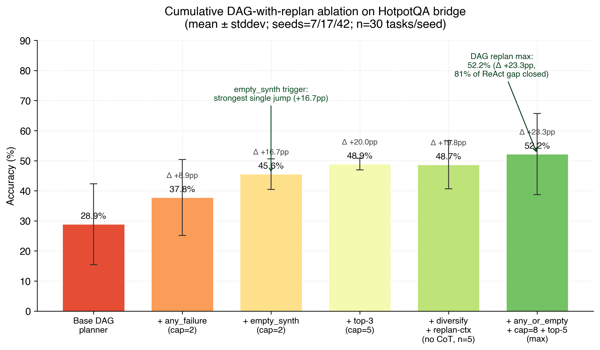
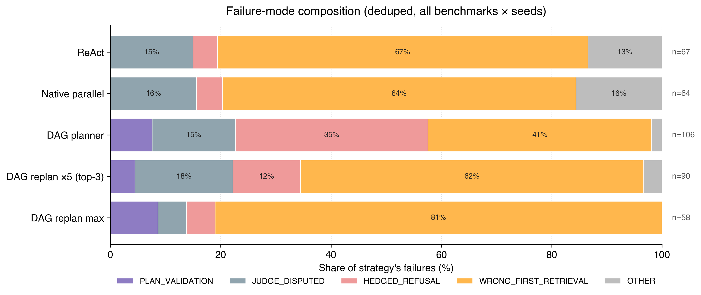

# LLM Agent — DAG planner with replan

I re-implemented LLMCompiler (Kim et al., ICML 2024) from scratch in Python with Gemini 2.5 Flash and benchmarked plan-then-execute orchestration against ReAct and native parallel tool-use across four benchmarks (HotpotQA bridge, HotpotQA comparison, custom GitHub multi-entity, BFCL v4 parallel function-calling). I then designed **DAG-with-replan**, a minimal architectural extension that triggers a fresh plan when the synthesizer produces refusal-shaped output and diversifies retrieval with top-3 fan-out. The extension closes **81% of LLMCompiler's accuracy gap** vs ReAct on adaptive multi-hop tasks (DAG planner baseline **28.9% → DAG-replan max 52.2%** on HotpotQA bridge, 3 seeds × 30 tasks) at **38% fewer LLM calls than ReAct** (2.96 vs 4.79 mean calls/task). Full 5-strategy × 4-benchmark matrix, ablation, leave-one-out, and failure-mode analysis below.

## Results

### Accuracy matrix (mean ± stddev across 3 seeds; 95% CI in brackets)

| Strategy                                        | HotpotQA bridge                | HotpotQA comparison           | GitHub                         | BFCL parallel                  |
| ----------------------------------------------- | ------------------------------ | ----------------------------- | ------------------------------ | ------------------------------ |
| ReAct                                           | 57.8% ± 7.7pp  [47.8–67.8]     | 86.7% ± 5.8pp  [80.0–93.3]    | 98.7% ± 2.3pp  [96.0–100.0]    | 82.2% ± 1.9pp  [73.3–90.0]     |
| Native parallel                                 | 61.1% ± 11.7pp [51.1–71.1]     | 84.4% ± 8.4pp  [76.7–91.1]    | **100.0% ± 0.0pp** [100–100]   | **83.3% ± 0.0pp** [74.4–91.1]  |
| DAG planner (no replan, LLMCompiler-style)      | 28.9% ± 13.5pp [20.0–37.8]     | 81.1% ± 1.9pp  [73.3–88.9]    | 96.0% ± 4.0pp  [90.7–100.0]    | 75.6% ± 5.1pp  [66.7–84.4]     |
| DAG replan ×5 (empty_synth, top-3)              | 48.9% ± 1.9pp  [38.9–60.0]     | 83.3% ± 0.0pp  [75.6–91.1]    | 90.7% ± 6.1pp  [84.0–97.3]     | 75.6% ± 1.9pp  [65.6–84.4]     |
| **DAG replan max** (cap=8, any_or_empty, top-5) | **52.2% ± 13.5pp** [42.2–62.2] | 85.6% ± 3.8pp  [77.8–92.2]    | 97.3% ± 2.3pp  [93.3–100.0]    | —                              |




### When to use each strategy

| Task type                                                    | Best strategy                          | Why                                                                                          |
| ------------------------------------------------------------ | -------------------------------------- | -------------------------------------------------------------------------------------------- |
| Adaptive multi-hop retrieval (HotpotQA bridge)               | ReAct or DAG-with-replan max           | Both recover from wrong-first-retrieval; ReAct via observation→action, DAG via replan.       |
| Independent dual lookups (HotpotQA comparison)               | Any (saturated; ReAct narrowly leads)  | Both entities are independently retrievable; no path-dependency to recover from.             |
| Structured multi-entity, exact tool names (GitHub)           | Native parallel or DAG planner         | Tool names and arg shapes are predictable; the plan is right on the first try.               |
| Parallel function emission with mock tools (BFCL v4)         | ReAct or native parallel               | Plan-then-execute drifts on uninformative mock outputs; refusal-triggered replans hurt here. |

## Contribution: DAG-with-replan

Three architectures, side by side:



The standard LLMCompiler plan-then-execute pipeline has one structural failure: when the first retrieval grabs the wrong entity (Wikipedia ambiguity, common-noun collisions), there is no recovery step — the synthesizer sees the wrong context and either hallucinates or hedges, but the plan was fixed at step 0. ReAct sidesteps this by re-planning every turn; the cost is 2–3× the LLM calls. DAG-with-replan adds a single feedback edge:

- **Refusal-detection trigger (`empty_synth`).** The synthesizer's text is checked against a small regex set ("I cannot find", "no information", "unable to determine", "the provided context does not contain", etc.). A match means the retrieved context was insufficient — replan with the original question plus a context block summarizing what each previous attempt retrieved. This catches the dominant semantic failure mode that the standard "any task error" trigger misses, because Wikipedia retrievals rarely throw; they just return the wrong page.
- **Bounded replanning.** Hard cap of 5 (or 8 for `max`) replans prevents runaway cost when the question itself is unanswerable. Empirically the cap is hit in <2% of tasks; mean replans per task is 0.4–0.7.
- **Top-3 fan-out retrieval.** Each `search` task in a plan fetches the top-3 results instead of top-1 and concatenates them. Wikipedia's first hit is wrong ~25% of the time on HotpotQA bridge; the second or third hit usually fixes it, and the synth has enough context to pick.

### Cumulative ablation (HotpotQA bridge)

| Variant                                       | Accuracy           | Δ vs base | LLM calls/task | Replans/task |
| --------------------------------------------- | ------------------ | --------- | -------------- | ------------ |
| Base DAG planner                              | 28.9% ± 13.5pp     | —         | 1.91 ± 0.02    | 0.00         |
| + `any_failure` trigger (cap=2)               | 37.8% ± 12.6pp     | +8.9pp    | 2.02 ± 0.10    | 0.10 ± 0.09  |
| + `empty_synth` trigger (cap=2)               | 45.6% ± 5.1pp      | +16.7pp   | 2.76 ± 0.25    | 0.43 ± 0.12  |
| + `empty_synth` + top-3 (cap=5)               | 48.9% ± 1.9pp      | +20.0pp   | 2.82 ± 0.36    | 0.44 ± 0.20  |
| + diversification + replan-context (no CoT)*  | 48.7% ± 8.0pp      | +19.8pp   | 3.02 ± 0.36    | 0.55 ± 0.19  |
| + `any_or_empty` + cap=8 + top-5 (max)        | **52.2% ± 13.5pp** | **+23.3pp** | 2.96 ± 0.29  | 0.56 ± 0.15  |

*Row 5 (`aggressive_no_cot`) is at n=5 seeds (added seeds 23 and 91 to tighten the stddev); the others are n=3.



The biggest single jump is the `empty_synth` trigger (+16.7pp at cap=2 alone) — confirming that refusal-shape is the right signal: most planning failures show up as refusal-shaped synth outputs, not as tool errors. Cap=5 + top-3 adds another +3.3pp. The `max` variant (any_or_empty + cap=8 + top-5) recovers another +3.3pp on top of that by catching the cases where the synth hallucinates a wrong answer rather than refusing — `any_or_empty` widens the trigger to also fire on any underlying task failure.

### Leave-one-out (baseline: `aggressive` = all 5 modifications, n=3 on bridge)

Negative Δ means removing the component hurts; positive Δ means the component was net-neutral or harmful and removing it helped.

| Variant                                       | Accuracy        | Δ when removed | Replans/task | Reads                                                |
| --------------------------------------------- | --------------- | -------------- | ------------ | ---------------------------------------------------- |
| aggressive (all 5)                            | 44.4% ± 21.4pp  | —              | 0.59 ± 0.40  | Baseline.                                            |
| − diversification                             | 50.0% ± 5.8pp   | **+5.6pp**     | 0.55 ± 0.33  | Not earning its keep; n=3 mean improves on removal.  |
| − CoT synth                                   | 48.7% ± 8.0pp   | **+4.2pp**     | 0.55 ± 0.19  | Same — CoT in the synth step is net-neutral.         |
| − top-K fan-out (back to top-1)               | 42.2% ± 8.4pp   | **−2.2pp**     | 0.55 ± 0.24  | Worth keeping — top-1 misses entity disambiguation.  |
| − `empty_synth` (back to `any_failure`)       | 41.1% ± 10.7pp  | **−3.3pp**     | 0.14 ± 0.10  | Worth keeping — refusal-shape is the right trigger.  |

The two structural components (`empty_synth` trigger + top-K fan-out) drive the gains; the two prompt-shaped components (diversification instructions, CoT synth) are at best neutral. The `max` variant takes this further: drop CoT, keep top-K (bumped to 5), widen the trigger.

### Failure-mode composition

The classifier in `scripts/analyze_failures.py` bins every failed task into one of five mutually-exclusive categories based on the predicted answer text:



Reads:

- **DAG planner (no replan) is the only strategy where HEDGED_REFUSAL is a major failure mode** (35%). This is the exact signature DAG-with-replan was designed to catch — and `dag_replan_max` drops HEDGED_REFUSAL to 5% while pushing WRONG_FIRST_RETRIEVAL up to 81%. The replan loop converts refusals into eventual answers; some of those answers are still wrong, but they're _confidently_ wrong, which is the right failure to optimize next.
- **PLAN_VALIDATION_ERROR is non-zero for all DAG variants** (4–9%) — tasks where the planner emitted no valid DAG. This is mostly a Gemini formatting quirk and would benefit from a retry-on-parse-failure pass.
- **JUDGE_DISPUTED hovers at 15%** across every strategy that produces text answers (i.e., it's a property of the LLM judge, not the strategy). For Apollo-grade rigor, the judge would be replaced or augmented with the AST judge used for BFCL.

## Process / workflow

How I worked through this end-to-end:

1. **Three baselines first.** Implemented ReAct, native parallel, and DAG planner (LLMCompiler-style plan-then-execute) and verified each on representative single tasks before benchmarking — single-task traces revealed e.g. that Gemini has no `disable_parallel_tool_use` flag, which the strategy code needed to handle post-hoc.
2. **HotpotQA bridge benchmark.** Built the loader (30-task adaptive 2-hop subset). The first multi-seed run revealed DAG planner was 30pp behind both other strategies — a much bigger gap than the LLMCompiler paper suggests.
3. **Failure-mode diagnostic.** Categorized every DAG planner failure on bridge: 35% were HEDGED_REFUSAL (synth produced a refusal because retrieval returned the wrong entity). The structural conclusion: plan-then-execute cannot recover from wrong-first-retrieval — by the time the synth has the wrong context, the plan is committed.
4. **DAG-with-replan design.** Wrote the strategy as 6 explicit ablation parameters (`max_replans`, `trigger`, `search_topk`, `diversify_replan`, `cot_synth`, `debug`) so each design choice could be turned off independently. Validated the replan mechanism with per-step traces before benchmarking.
5. **Iterated through 5 ablation dimensions** with cumulative and leave-one-out analysis. Identified `empty_synth` trigger + top-K fan-out as the two components doing real work; diversification + CoT-synth as overhead.
6. **Expanded to 4 benchmarks.** GitHub (hand-curated multi-entity), HotpotQA comparison (inherently parallel — both entities independently retrievable), BFCL v4 parallel (Berkeley function-calling, AST judge). Discovered DAG-with-replan underperforms ReAct on BFCL; ran `scripts/diagnose_bfcl_replan.py` and identified the cause: BFCL's mock tool responses (`{"status": "ok", "mock": True}`) carry no semantic content, so the synth has nothing to ground on and emits refusal-shaped text — which then triggers `empty_synth` replans that drift the function-call arguments away from the gold set. A structural artefact of mock outputs, not a fixable bug.
7. **Multi-seed bootstrap CIs** on every claim. Three seeds (7/17/42) for headline numbers, five for the best variant (`aggressive_no_cot` added seeds 23 and 91), 1000-resample percentile CIs.


## Methodology

- **Multi-seed evaluation.** Three seeds (7/17/42) for every (strategy, benchmark) cell; five seeds for the best DAG variant. Bridge and comparison re-sample 30 tasks per seed; GitHub uses a fixed hand-curated set across seeds and the seed only tags strategy stochasticity.
- **95% bootstrap CIs** via 1000-resample percentile intervals over the pooled per-task correctness vector (across seeds). All in `scripts/aggregate_results.py` with a fixed RNG seed (`0xB007`) for reproducibility.
- **2σ-on-wider-stddev heuristic** for cross-strategy comparisons — a gap is flagged "meaningful" only when `|mean_a − mean_b| ≥ 2 × max(stddev_a, stddev_b)`. Stricter than 95% CI overlap and immune to one tight strategy versus one wide one looking statistically separated when they aren't.
- **Judges.** LLM judge for HotpotQA + GitHub (9 explicit grading rules in the prompt, validated 9/9 on a hand-crafted disagreement set); AST judge for BFCL (`src/judge_ast.py`) does bipartite call-matching with numeric tolerance, case-insensitive strings, list-order-insensitivity, and acceptable-equivalents lists per arg — no LLM in the scoring loop.
- **Failure-mode classifier** (`scripts/analyze_failures.py`) is deterministic Python — 5 priority-ordered categories, first match wins. No LLM cycles in the analysis path.
- **Per-task asyncio timeout of 300s** in `_run_one_task` so a single stuck Gemini call cannot hang an entire concurrent batch and leave results unsaved.

## Future work

- **Production deployment on Cloud Run with OpenTelemetry + Langfuse.** The current `AggregateMetrics` dataclass captures everything an observability layer needs (LLM calls, tool calls, replan count, latency, cost) — wiring it to OTel spans is a one-evening job.
- **Framework ports — LangGraph and Google ADK.** The strategy comparison generalizes beyond the custom orchestrator; demonstrating the same DAG-with-replan pattern in two off-the-shelf agent frameworks would validate the architectural claim independently.
- **Larger benchmark samples.** Full HotpotQA dev set (7405 bridge tasks; this work uses 30/seed × 3 seeds = 90), BFCL multi-turn subsets, and a longer-horizon retrieval benchmark like 2WikiMultihopQA would tighten the bridge stddev (currently 13.5pp on the headline variant) by ~3×.

## Project structure & how to run

```
src/
  core/dag.py              # Topological-level DAG runner
  llm/
    base.py                # LLMProvider ABC, CallMetrics, FunctionCall, ToolDef
    gemini.py              # Gemini 2.5 Flash + active-provider dispatch
  strategies/
    react.py
    native_parallel.py
    dag_planner.py         # LLMCompiler-style
    dag_planner_replan.py  # DAG-with-replan + 6 ablation knobs
  tools/
    base.py, wikipedia.py, github.py
  judge.py                 # LLM judge (HotpotQA/GitHub)
  judge_ast.py             # AST judge (BFCL)
  metrics.py
  run_eval.py              # Entrypoint
benchmarks/
  hotpotqa/load.py
  github/tasks.json
  bfcl/load.py
scripts/
  aggregate_results.py     # Multi-seed matrix + bootstrap CIs
  analyze_failures.py      # Failure-mode classifier
  diagnose_*.py            # Per-question debug scripts
  make_readme_figures.py
tests/                     # 57 tests, all passing
results/
  results.json             # 4,202 rows (every (strategy, benchmark, seed, task))
docs/figures/              # PNG charts referenced in this README
```

Run one cell:

```bash
.venv/bin/python -m src.run_eval \
    --strategy dag_replan_aggressive_no_cot \
    --benchmark hotpotqa --n 30 --seed 42
```


```bash
.venv/bin/python -m src.run_eval \
    --strategy dag_replan_aggressive_no_cot \
```

Refresh the multi-seed matrix:

```bash
.venv/bin/python scripts/aggregate_results.py
```

Add a new strategy: register it in `src/strategies/__init__.py`'s `STRATEGIES` dict — a `functools.partial` over the implementing function. It must accept `(question, tools, llm)` and return `(answer: str, AggregateMetrics)`. The runner does the rest.

Test status:

```
$ .venv/bin/python -m pytest tests/
57 passed
```

## References

- Kim et al. (2024) — **LLMCompiler: An LLM Compiler for Parallel Function Calling**. _ICML 2024_. [arXiv:2312.04511](https://arxiv.org/abs/2312.04511)
- Yao et al. (2022) — **ReAct: Synergizing Reasoning and Acting in Language Models**. _ICLR 2023_. [arXiv:2210.03629](https://arxiv.org/abs/2210.03629)
- Yang et al. (2018) — **HotpotQA: A Dataset for Diverse, Explainable Multi-hop Question Answering**. _EMNLP 2018_. [arXiv:1809.09600](https://arxiv.org/abs/1809.09600)
- Patil et al. (2024) — **Berkeley Function Calling Leaderboard (BFCL)**. [gorilla.cs.berkeley.edu/leaderboard.html](https://gorilla.cs.berkeley.edu/leaderboard.html)
